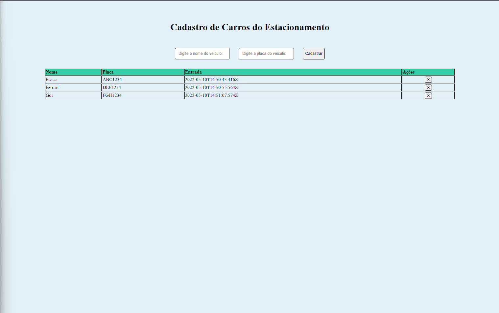
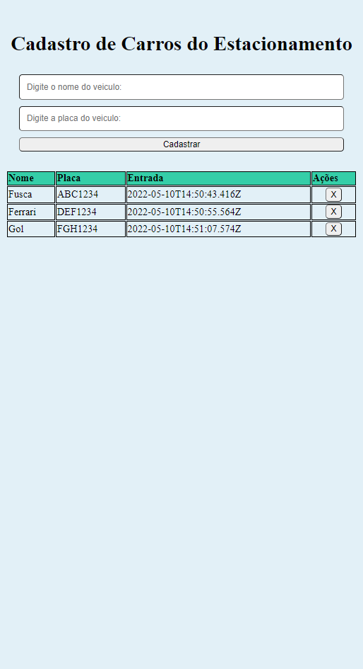

Projeto DIO Estacionamento

Foi desenvolvida um Contrele de Carros para Estacioanamento com o superset do JavaScript o TypeScript. Com objetivo cadastrar os carros e fazer o calculo do tempo em que o carro ficou no estacionamento e rever os conhecimentos adquiridos sobre TypeScript. 

Resultado final

Visão geral na tela de Desktop e Tablet

Visão geral na tela de smartphone

